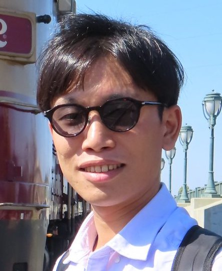

<h1 style="text-align:center; margin-bottom:20pt; !important"> Program </h1>

The program will consist of posters and presentations based on the submitted papers.    
Additionally, we invited four speakers actively working at the intersection climate change and NLP, and asked them to give a presentation about their perspective on this intersection. These speakers are (ordered alphabetically).

 <a href="https://ie.unc.edu/people/hsu/">Angel Hsu</a>   
 Dr. Angel Hsu is an Assoicate Professor of Public Policy and the Environment at UNC-Chapel Hill. She is the founder and director of the Data-Driven EnviroLab. Her research explores the intersection of science and policy and the use of data-driven approaches to understand environmental sustainability, particularly for climate change and energy, urbanization and air quality. Her research applies data from satellite remote sensing and other spatially-explicit sources to evaluate environmental policy performance. She was a contributing author to the IPCC 6th Assessment Report and a nominated expert for the forthcoming IPCC Special Report on Cities. She has a Ph.D. in Environmental Policy from Yale University and was formerly an Assistant Professor of Environmental Studies at Yale-NUS College in Singapore.

 

 Gaku Mori
 Gaku Morio is a researcher at Hitachi America, Ltd., and also a Visiting Scholar at Stanford University. Over the past few years, his focus has been on argument mining and its applications. Recently, his interests include the development of datasets, tasks, and models within the context of sustainability, especially with a focus on the basis of greenwashing detection.

 

 David Thulke
 David Thulke is a PhD candidate in the Machine Learning and Human Language Technology group at RWTH Aachen University and a language processing scientist at AppTek. His research focuses on advancing foundation models and their application to different natural language understanding and generation tasks. Notably, he focuses on increasing the factuality of language generation models among others using retrieval augmented generation. He is one of the main scientists involved in the ClimateGPT project, which developed domain-specific large language models synthesizing interdisciplinary research on climate change.

 
